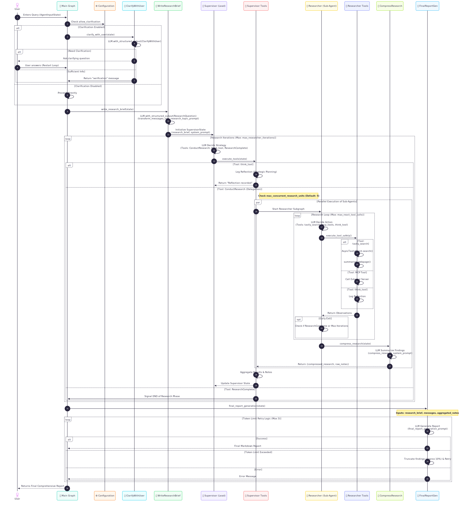

### 🚀 Quickstart

1. Clone the repository and activate a virtual environment:
```bash
git clone git@github.com:AndrijaDumancic/open_deep_research.git
cd open_deep_research
uv venv
source .venv/bin/activate  # On Windows: .venv\Scripts\activate
```

2. Install dependencies:
Make sure you have `uv` installed.
[uv docs](https://docs.astral.sh/uv/getting-started/installation)
```bash
uv sync
# or
uv pip install -r pyproject.toml
```

1. Set up your `.env` file to customize the environment variables (for model selection, search tools, and other configuration settings):
```bash
cp .env.example .env
```

1. Launch agent with the LangGraph server locally:

```bash
# Install dependencies and start the LangGraph server
uvx --refresh --from "langgraph-cli[inmem]" --with-editable . --python 3.11 langgraph dev --allow-blocking
```

This will open the LangGraph Studio UI in your browser.

```
- 🚀 API: http://127.0.0.1:2024
- 🎨 Studio UI: https://smith.langchain.com/studio/?baseUrl=http://127.0.0.1:2024
- 📚 API Docs: http://127.0.0.1:2024/docs
```

Ask a question in the `messages` input field and click `Submit`. Select different configuration in the "Manage Assistants" tab.


### Workflow

This diagram captures the full lifecycle of the Deep Research Agent, including:
- Configuration Checks: Logic gates for clarification and API settings.
- State Management: Passing of ResearchQuestion, AgentState, and SupervisorState.
- Parallel Execution: The par block showing concurrent sub-agents.
- Tool Chains: Specific calls to Tavily, Summarizers, and Reflection (think_tool).
- Error Handling: Retry logic for token limits and formatting.

